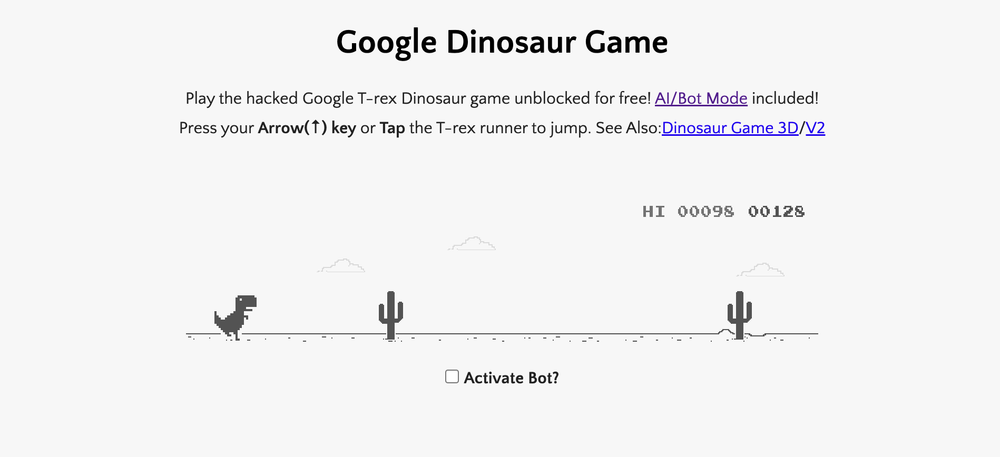

# Google Dinosaur Game Automation
This is a Python program that automates the Google Dinosaur game using the `pyautogui` and `PIL` libraries.

## Requirements
- Python 3.x
- pyautogui
- PIL
## Installation
1. Install Python 3.x from the [official website](https://www.python.org/downloads/).
2. Open a command prompt or terminal window.
3. Type the following command and press Enter:
    ```
    pip install pyautogui
    ```
4. Type the following command and press Enter:
    ```
    pip install pillow
    ```
## Usage
1. Open the Google Chrome browser and navigate to the [Google Dinosaur game](https://trex-runner.com/).
2. Start the program by running the following command in a command prompt or terminal window:
    ```
    python dinosaur.py
    ```
3. The program will automatically detect obstacles and make the dinosaur jump over them.
4. 

